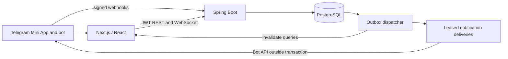

# Gather architecture

Gather is a Telegram Mini App and bot backed by a Java modular monolith. PostgreSQL owns users, community membership, event plans, attendance, availability, structured discussion, and durable asynchronous work.

## Consistency

Event edits, cancel, lock and finalization require `If-Match: "version"`. Stale writes return 412; missing preconditions return 428. The event row lock serializes capacity and lifecycle changes. JPA version changes track organizer edits, not RSVP or discussion activity. RSVP writes are idempotent. A bounded 256-stripe admission queue serializes HTTP RSVP mutations before transaction creation to prevent a hot event from consuming the JDBC pool; the PostgreSQL lock remains authoritative for every writer. Participant summaries are read after commit. The waitlist uses time of entering the queue and UUID as a deterministic tie-breaker.

Availability replacement locks the event, validates bounds, and replaces one user's intervals atomically. Overlaps and adjacent intervals merge. Only Going/Maybe attendees affect recommendations. Scoring canonical intervals uses two difference arrays and a constant-size top-three selection; normalization is separate and includes sorting.

Domain mutations publish synchronous in-process events that insert outbox rows in the same database transaction. Immutable snapshots are captured from the mutation state. The dispatcher polls every 25 ms and locks up to 200 pending rows using SKIP LOCKED, inserts unique delivery rows, emits harmless duplicate cache invalidations, then marks processing complete. A rollback preserves pending work. Clients reauthenticate, resubscribe, and refetch after reconnect; subscription acknowledgement also invalidates cached data.

Telegram workers claim individual deliveries with a 30-second lease and a fencing UUID. They commit the claim, call Telegram with a ten-second timeout, and conditionally finish only their current lease. Five total attempts, bounded retry backoff, and Telegram retry-after are supported. An ambiguous network response can result in duplicate external messages. Membership, mute and DM permissions are checked before sending; obsolete reminders are skipped.

## Access and privacy

Telegram numeric IDs are identity. HMAC-validated launch data must be fresh. JWTs last 60 minutes and live only in client memory. Database membership authorizes every community resource; shared Telegram chat context is not authorization. `/setup` verifies user and bot administrator status. Anonymous-admin commands are rejected because they do not identify the actor. Membership updates revoke access; rejoining requires `/join`.

Leaving an enrolled group releases upcoming reservations and promotes waitlisted attendees. Removed organizers' events remain available to community administrators. Bot removal disables access to the community. Availability details are private to the submitting user; other members see aggregate recommendations. Calendar exports require authentication. Comments are plain text.

## Operational boundary

One backend instance owns WebSocket subscribers. The database supports multiple workers but deploying multiple API replicas would need cross-instance invalidation. No Redis, Kafka, media storage, OAuth calendar access, native applications, or social graph exists in V1. See the seven [ADRs](adr/ADR-001.md).
